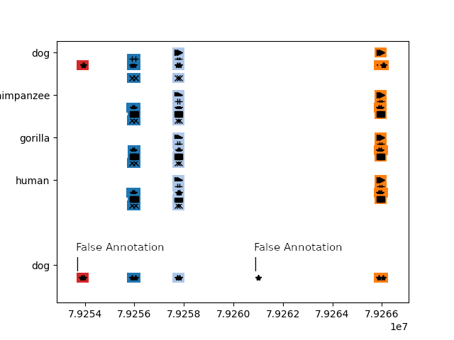
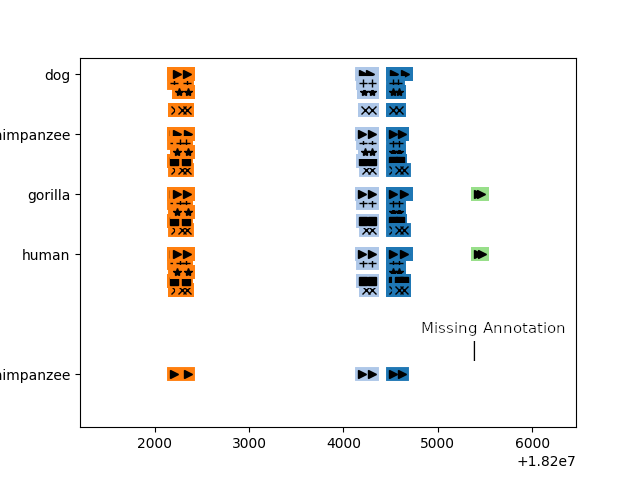

CDS Consensus Annotation
==============================

Motivation
------
Primal Databases for genome data, such as Genbank, contain mostly low-quality, automatically predicted genome annotation.  
There are attempts to make the annotation more consistent, such as NCBI's RefSeq database.   
In practice, these databases still suffer from unreliable, and inconsistent annotations, which makes it harder to use them for
downstream tasks, such as training machine learning models.  
  
Traditionally, the CDS (coding region of a gene) is predicted by alignment to a protein database. 
In this project, we aim to explore and develop automatic tools, to see if whether instead of protein-genome alignment,
creating consistent annotation through genome-genome alignment leads to better, more consistent results.


Description
--------
We cluster different cds pieces into different types, using a combination of cd-hit-psi, tbasltx and
graph community finding algorithms. The clustered pieces are aligned to a target genome to help annotation.  
  
The overall goal is to annotate cds regions in the genome based on cds annotations in other genomes, thereby creating a consistent annotation.


Examples
----------
### Detecting False Annotations in NCBI



Example generated by aligning CDS pieces from different species (PLA2G2 family),  to dog's PLAG2C gene region.  
No other CDS aligns to the marked CDS pieces in dog, therefore it's likely a false annotation in NCBI's RefSeq.  

### Detecting Missing Annotations in NCBI



Example generated by aligning CDS pieces from different species (PLA2G2 family),  to chimp's PLAG2E gene region.  
Other CDS from the gene-family align to an un-annotated region in chimp's genome, therefore it's likely a missing annotation in NCBI's RefSeq.  


Requirements
------------
To activate environment, first make sure ```conda``` is installed on the system:  
https://docs.conda.io/projects/conda/en/latest/user-guide/install/index.html

Then, run:
```bash
conda env create -f environment.yml
conda activate cds_consensus_annotation
```


This program requires the following dependencies to be installed and available in the PATH environment variable:

    CD-HIT: https://github.com/weizhongli/cdhit
    NCBI's Blast: https://ftp.ncbi.nlm.nih.gov/blast/executables/blast+/LATEST

Make sure these dependencies are properly installed and configured before running the program to ensure its proper operation.

Running the code
---------------
Make sure the relevant .gff files are in ```data/raw/gff_files``` (download from: https://www.ncbi.nlm.nih.gov/), then run the following. 
This is required only once, to convert any ```.gff``` files that haven't been turned into a ```.db``` yet:
```bash
python src/data/make_gff_fbs.py
```

To run the main script, run:
```bash
python src/main.py --email <your@email.address>
```
Any plots will be saved under ```reports/figures```.

Project Organization
------------

    ├── README.md          <- The top-level README for developers using this project.
    ├── data
    │   ├── interim        <- Intermediate data that has been transformed.
    │   ├── processed      <- The final, canonical data sets for modeling.
    │   └── raw            <- The original, immutable data dump.
    │
    ├── references         <- Data dictionaries, manuals, and all other explanatory materials.
    │
    ├── reports            <- Generated analysis as HTML, PDF, LaTeX, etc.
    │   └── figures        <- Generated graphics and figures to be used in reporting
    │
    ├── environment.txt   <- The file for reproducing the analysis environment.
    │ 
    ├── src                <- Source code for use in this project.
    │   ├── __init__.py    <- Makes src a Python module
    │   │
    │   ├── data           <- Scripts to download or generate data
    │   │   └── 
    │   └── visualization  <- Scripts to create exploratory and results oriented visualizations
    │       └── visualize.py
    │


--------

Credit
-------
This project was done as an interdisciplinary project by Shlomo Libo Feigin at the Technical University of Munich, in collaboration with RostLab, under the supervision of Dr. Ivan Koludarov and Prof. Burkhard Rost, with the help of Dmitrii Nechaev.

<p><small>Project based on the <a target="_blank" href="https://drivendata.github.io/cookiecutter-data-science/">cookiecutter data science project template</a>. #cookiecutterdatascience</small></p>
